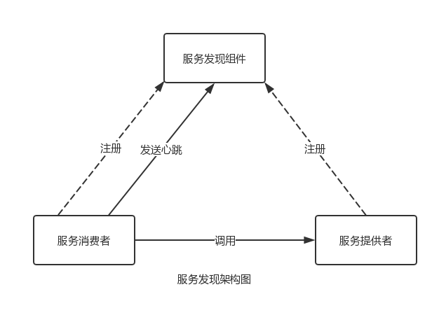
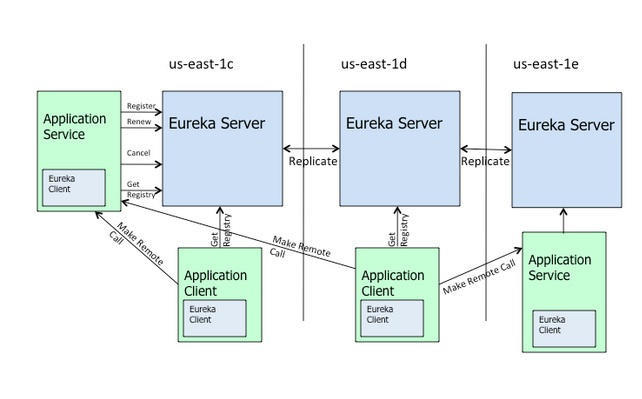

# Eureka
服务注册、服务发现、服务检查
- eureka server
- eureka client
- eureka server 高可用
- eureka 的自我保护模式
### 注：
1. 在生产环境中，通常会部署一个高可用的Eureka Server集群  




# Ribbon
Ribbon是负载均衡器，用来实现客户端侧的负载均衡

### 脱离Eureka使用Ribbon
需求：未注册到Eureka Server或者非Spring Cloud开发的服务使用Ribbon实现负载均衡
### 注：
1. 一般来说，在生产环境中，各个微服务都会部署多个实例

# Feign
声明式、模板化的HTTP客户端，支持Spring MVC注解，方便调用HTTP API.
 
 ### Feign 的日志
 需求：了解Feign处理请求的具体细节
 
 ### 使用Feign构造多参数请求
 1. GET请求
 ```java
@FeignClient(name = "user")
public interface UserFeignClient {
    @RequestMapping(value = "/get", method = RequestMethod.GET)
    public User get(@RequestParam("id") Long id, @RequestParam("username") String username);
}
```
```java
@FeignClient(name = "user")
public interface UserFeignClient {
    @RequestMapping(value = "/get", method = RequestMethod.GET)
    public User get(@RequestParam java.util.Map<String, Object> map);
}
```
2. POST请求
```java
@FeignClient(name = "user")
public interface UserFeignClient {
    @RequestMapping(value = "/post", method = RequestMethod.POST)
    public User post(@RequestBody User user);
}
```
### 注：
1. feignClient中interface的写法要注意，不然接口会掉不通

# Hystrix
一个延迟和容错库，用于隔离访问远程系统、服务或者第三方库，防止级联失败，从而提升系统的可用性与容错性。

### 容错机制要求
- 为网络请求设置超时
- 使用断路器模式

### 容错机制实现
- 包裹请求
- 跳闸机制
- 资源隔离
- 监控
- 回退机制
- 自我修复

### Feign 使用 Hystrix
请务必注意：在Spring Cloud Dalston中，Feign默认是不开启Hystrix的。因此，如使用Dalston请务必额外设置属性：feign.hystrix.enabled=true，否则断路器不会生效。而，Spring Cloud Angel/Brixton/Camden中，Feign默认都是开启Hystrix的。无需设置该属性。

### 通过Fallback Factory检查回退原因

### 为Feign禁用Hystrix
在spring cloud中，只要Hystrix在项目的classpath中，Feign就会使用断路器包裹Feign客户端的所有方法。这样虽然方便，但很多场景下并不需要该功能。
- 为指定Feign客户端禁用Hystrix
```java
// 配置
@Configuration
public class FeignDisableHystrixConfiguration {
    @Bean
    @Scope("prototype")
    public Feign.Builder feignBuilder() {
        return Feign.builder();
    }
}

// 使用
@FeignClient(name="user", configuration=FeignDisableHystrixConfiguration.class)
public interface UserFeignClient {
    //...
}
```
- 全局禁用Hystrix  
application.yml文件中配置：
```yaml
feign:
  hystrix:
    enabled: false
```

### Hystrix监控


### 使用turbine聚合监控数据
一个聚合Hystrix监控数据的工具，将所有/hystrix.stream端点的数据聚合到一个组合的/turbine.stream中。

- 使用消息中间件收集数据  
某些场景下（例如微服务与Turbine网络不通），则可借助消息中间件实现数据的收集

- 注：在spring cloud Camden SR4中，依赖spring-cloud-starter-turbine不能与spring-cloud-starter-turbine-stream共存，否则启动时会报异常。

# Docker
开源的容器引擎，有助于更快的交付应用  
- Docker daemon（Docker守护进程）
- Client（Docker客户端）
- Images（Docker镜像）
- Container（容器）
- Registry（注册中心）

### 安装Docker

### 配置镜像加速器
- Docker 版本在 1.12 或更高:  
```
1. 创建或修改 /etc/docker/daemon.json 文件
vim /etc/docker/daemon.json
{
    "registry-mirrors": [
        "http://f1615e4e.m.daocloud.io"
    ],
    "insecure-registries": []
}
2. 重启docker服务
systemctl restart docker
```

### Docker常用命令
- Docker镜像常用命令
```
docker search imageName         # 搜索镜像
docker pull imageName           # 拉取镜像
docker images                   # 列出镜像
docker rmi imageName            # 删除镜像
docker rmi -f $(docker images)  # 删除所有镜像
```
- Docker容器常用命令
```
# 新建并启动容器（-d：后台运行；-p：指定端口映射；/bin/echo：终端打印字符串）
docker run [-d -p 宿主机端口:容器端口] imageName [/bin/echo 'Hello Docker']
docker ps                   # 列出容器
docker stop containerId     # 停止容器
docker kill containerId     # 强制停止容器
docker start containerId    # 启动已停止的容器
docker restart containerId  # 重启容器
# 进入容器
docker inspect --format "{{.State.Pid}}" containerId # 获取容器第一个进程的PID
nsenter --target "$PID" --mount --uts --ipc --net --pid #进入容器
docker rm containerId           # 删除已停止的容器 
docker r -f $(docker ps -a -q)  # 删除所有容器
```

### Dockerfile构建镜像

### Docker Compose编配微服务
使用Compose管理容器

# 常见问题
## 1. 已停止的微服务节点注销慢或不注销
- 问题描述：  
在开发环境下，希望Eureka Server能迅速有效地注销已停止的微服务实例。由于Eureka Server清理无效节点周期长（默认90秒），以及自我保护模式等原因，可能会遇到微服务注销慢甚至不注销的问题。
- 解决方案：  
```yaml
# Eureka Server 配置
eureka:
  server:
    enable-self-preservation: false # 关闭自我保护
    eviction-interval-timer-in-ms: 4000 # 清理间隔（单位：ms，默认：60*1000）
    
# Eureka Client 配置
eureka:
  client:
    healthcheck:
      enabled: true # 开启健康检查
  instance:
    lease-expiration-duration-in-seconds: 30  # 续约更新时间间隔（默认30s）
    lease-renewal-interval-in-seconds: 10 # 续约到期时间（默认90s）
```
- 注：
这些配置仅建议在开发或测试时使用，生产环境建议坚持使用默认值。